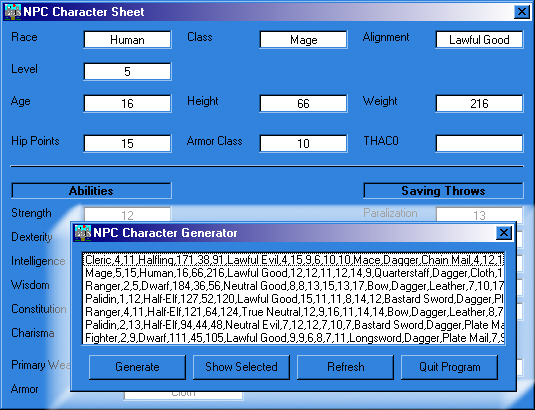



## An AD&D NPC Generator

### Description

<<Update>> Fixed most of the logic problems and other issues with rules and guidlines set by TSR... This program generates a simple character for use with AD&D. It stores the values in a text file where it reads them back to view and generate a list. I realize there are better, faster ways to accomplish this, but I am only a hobbiest and self taught and slowly learning. Constructive comments are appreciated.
 
### More Info
 

             |
---                |---
**Submitted On**   |2000-06-23 11:38:08
**By**             |[VBScript](https://github.com/Planet-Source-Code/PSCIndex/blob/master/ByAuthor/vbscript.md)
**Level**          |Intermediate
**User Rating**    |4.4 (22 globes from 5 users)
**Compatibility**  |VB 5\.0, VB 6\.0
**Category**       |[Games](https://github.com/Planet-Source-Code/PSCIndex/blob/master/ByCategory/games__1-38.md)
**World**          |[Visual Basic](https://github.com/Planet-Source-Code/PSCIndex/blob/master/ByWorld/visual-basic.md)
**Archive File**   |[CODE\_UPLOAD70326232000\.zip](https://github.com/Planet-Source-Code/vbscript-an-ad-d-npc-generator__1-9107/archive/master.zip)

